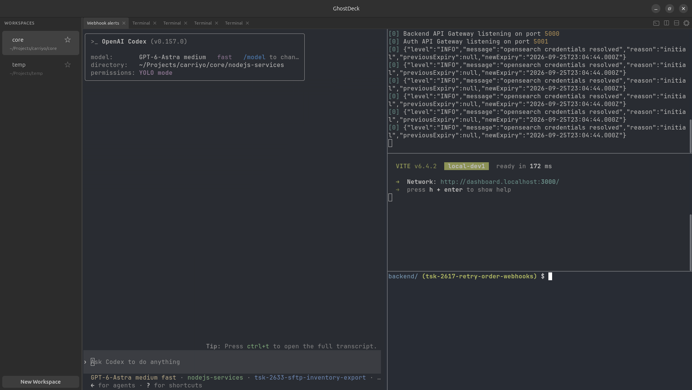

# GhostDeck

Ghostty terminal workspace with built-in desktop and agent integration



## Features

- **Ghostty:** the same GPU-rendered Ghostty you love.
- **Workspaces, tabs, and splits:** all with keyboard navigation.
- **OS notification hooks for agents:** so you don't miss updates when an AI agent completes a task.
- **Restore layout:** remembers workspaces, tabs, and splits when you close GhostDeck, then restores them on startup.
- **Agent-created surfaces:** skill and CLI support for agents to create terminal surfaces, run commands, and close them.

## Install

When release packages are published, they will be available from [GitHub Releases](https://github.com/Munawwar/GhostDeck/releases).

**Debian/Ubuntu (.deb)** — recommended:
```bash
sudo dpkg -i ./ghostdeck_*_amd64.deb
```

**AppImage** — portable across Ubuntu 24.04-era desktops and newer, no install needed:
```bash
chmod +x GhostDeck-*-x86_64.AppImage
./GhostDeck-*-x86_64.AppImage
```

Release AppImages are built and checked on the Ubuntu 24.04 `GLIBC_2.39`
floor. GhostDeck still uses the host GTK4 and libadwaita runtime
libraries, so older distributions may need the `.deb`, tarball, or a source
build with matching system packages instead.

**Tarball** — manual install:
```bash
tar xzf ghostdeck-*-linux-x86_64.tar.gz
cd ghostdeck-*-linux-x86_64
sudo ./install.sh
```

To uninstall:
```bash
# deb
sudo apt remove ghostdeck

# tarball
sudo ./install.sh --uninstall
```

### System dependencies

```bash
# Ubuntu/Debian
sudo apt install libgtk-4-1 libadwaita-1-0
```

## Build from source

### Prerequisites

- Rust toolchain (stable)
- Zig 0.15.2 (the version used by the current CI workflow)
- GTK4 and libadwaita dev packages
- Initialized Ghostty submodule

```bash
# Install dev dependencies (Ubuntu/Debian)
sudo apt install blueprint-compiler build-essential libadwaita-1-dev libepoxy-dev libgtk-4-dev libwebkitgtk-6.0-dev pkg-config

# Initialize Ghostty and build the embedded library with GhostDeck's Linux patch
git submodule update --init --recursive
./scripts/build-ghostty.sh -Dapp-runtime=none -Doptimize=ReleaseFast -Dcpu=baseline

# Build ghostdeck
cargo build --release

# Run (point to libghostty.so location)
LD_LIBRARY_PATH="ghostty/zig-out/lib${LD_LIBRARY_PATH:+:$LD_LIBRARY_PATH}" ./target/release/ghostdeck
```

Source builds produce `target/release/ghostdeck` for the GTK host and `target/release/ghostdeck-cli` for CLI commands. Installed packages expose the CLI as `ghostdeck`.

### Package a release

Push a `v*` tag to start the GitHub Actions build. It creates a GitHub Release
with the tarball, Debian package, AppImage, and RPM after packaging succeeds.

```bash
./scripts/package.sh
```

This builds a tarball and Debian package, plus an AppImage when `appimagetool` is installed and an RPM when `rpmbuild` is available. Packages are written to `dist/`. The script also rebuilds `libghostty.so` with `ReleaseFast` and `-Dcpu=baseline`, applying GhostDeck's Linux embedded patch in a temporary worktree.

## Development

Run the canonical local quality gate before committing:

```bash
./scripts/check.sh
```

Repository maintainability rules live in [`docs/maintainability.md`](docs/maintainability.md).

## Agent integrations

GhostDeck provides hooks for Codex, Claude Code, and Gemini CLI by default;
OpenCode hooks can be installed explicitly. Every terminal GhostDeck spawns auto-exports
`GHOSTDECK_WORKSPACE_ID` / `GHOSTDECK_SURFACE_ID` / `GHOSTDECK_PANE_ID` /
`GHOSTDECK_TAB_ID` / `GHOSTDECK_SOCKET`, so the CLI auto-targets the right place
with no flags needed from inside the agent's own terminal.

```bash
# Fire a libadwaita toast + sidebar unread badge from any agent
ghostdeck notify --subtitle "needs review" --body "blocked on auth choice" "Input needed"

# Install GhostDeck session-restore hooks for supported agents
ghostdeck hooks setup

# Install GhostDeck's compact agent skill for Codex
ghostdeck skill setup codex

# Drop-in hook handlers translate hook JSON on stdin into notify/session state
echo '{"event":"stop"}' | ghostdeck claude-hook --event stop
echo '{"event":"finished"}' | ghostdeck gemini-hook --event finished

# Spin up a multi-agent collaboration team in the current tab,
# launches each agent's CLI, and writes AGENTS.md describing the
# <agent-msg> XML protocol so peers can talk to each other:
ghostdeck agent-team --agents codex,claude --cwd "$PWD"
# → Codex and Claude can now do:
#   ghostdeck send --workspace claude $'<agent-msg from="codex" to="claude" id="…" ts="…">…</agent-msg>\n'

# Or launch another terminal agent beside the caller:
ghostdeck add-surface --cmd claude

# Add a visible process to the agent's current terminal tab. GhostDeck owns the
# layout: the agent starts on the left and up to three added surfaces stack on
# the right. No direction or target flags are accepted.
created="$(ghostdeck --json add-surface --cwd apps/web)"
surface="$(printf '%s\n' "$created" | jq -r '.surface_id')"
ghostdeck run --surface "$surface" --cmd 'npm run dev'
# Stop the foreground process with Ctrl+C, then remove the added surface:
ghostdeck close-surface --surface "$surface"

# Keep both agents in the same workspace on separate surfaces:
ghostdeck identify --json
ghostdeck list-panels --workspace "$GHOSTDECK_WORKSPACE_ID"
ghostdeck send --workspace "$GHOSTDECK_WORKSPACE_ID" --surface "<peer-surface-id>" \
  $'<agent-msg from="codex" to="claude" id="…" ts="…">…</agent-msg>\n'
```

See the auto-generated `AGENTS.md` (written into the shared cwd) for
the full protocol spec, peer table, and editable Policies section.

Checked-in hook templates live in [`hooks/`](hooks/). They mirror the default
`ghostdeck hooks setup` targets: Codex, Claude Code, and Gemini CLI. Install the
OpenCode integration explicitly with `ghostdeck hooks setup opencode`.

Coding agents working on **ghostdeck itself** should read [`AGENTS.md`](AGENTS.md)
and [`CLAUDE.md`](CLAUDE.md) in the repo root — those cover the build
loop and crate map.

## Keyboard shortcuts

Most default shortcuts use `Ctrl`. Fullscreen defaults to `F11`. Custom remaps may also use `Cmd`, which GhostDeck maps to either the Linux `Meta` or `Super` modifier. `Option` maps to `Alt`.

### App

| Shortcut | Action |
|---|---|
| `Ctrl+Q` | Quit GhostDeck |
| `Ctrl+Alt+N` | Open a new GhostDeck instance |
| `F11` | Toggle fullscreen |

### Find

| Shortcut | Action |
|---|---|
| `Ctrl+F` | Open find on the focused terminal |
| `Ctrl+G` | Find next |
| `Ctrl+Shift+G` | Find previous |
| `Ctrl+Shift+F` | Hide find |
| `Ctrl+E` | Use selection for find |

### Terminal

| Shortcut | Action |
|---|---|
| `Ctrl+K` | Clear scrollback |
| `Ctrl+Shift+C` | Copy selection |
| `Ctrl+Shift+V` | Paste |
| `Ctrl+=` | Increase font size |
| `Ctrl+-` | Decrease font size |
| `Ctrl+Shift+0` | Reset font size |

### Workspace And Terminal Surfaces

| Shortcut | Action |
|---|---|
| `Ctrl+Shift+N` | New workspace (folder picker) |
| `Ctrl+Shift+W` | Close workspace |
| `Ctrl+Shift+Left/Right` | Cycle terminal tabs |
| `Ctrl+Shift+D` | Split terminal down |
| `Ctrl+Shift+T` | New terminal tab |
| `Ctrl+D` | Split terminal right |
| `Ctrl+Shift+S` | Swap terminal surfaces in the focused tab |
| `Ctrl+M` | Toggle sidebar |
| `Ctrl+Shift+M` | Toggle top bar |
| `Ctrl+T` | New terminal tab |
| `Ctrl+Shift+,` / `Ctrl+Shift+.` | Focus surface left or right |
| `Ctrl+Shift+Up/Down` | Previous or next workspace |
| `Ctrl+1-8` | Switch to workspace by number |
| `Ctrl+9` | Switch to the last workspace |

## Architecture

```
rust/
  ghostdeck-host-linux/    # GTK4/Adwaita UI (window, sidebar, panes, tabs)
  ghostdeck-ghostty-sys/   # FFI bindings to libghostty
  ghostdeck-core/          # Command dispatcher and state engine
  ghostdeck-protocol/      # Socket wire format types
  ghostdeck-control/       # Unix socket server
  ghostdeck-cli/           # CLI client
```

The terminal rendering is handled by Ghostty 1.3.1's embedded library (`libghostty.so`) with GhostDeck's Linux patch. The UI layer is native GTK4 with libadwaita.

## License

MIT
